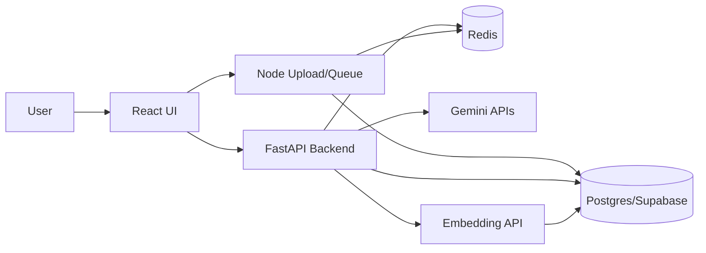
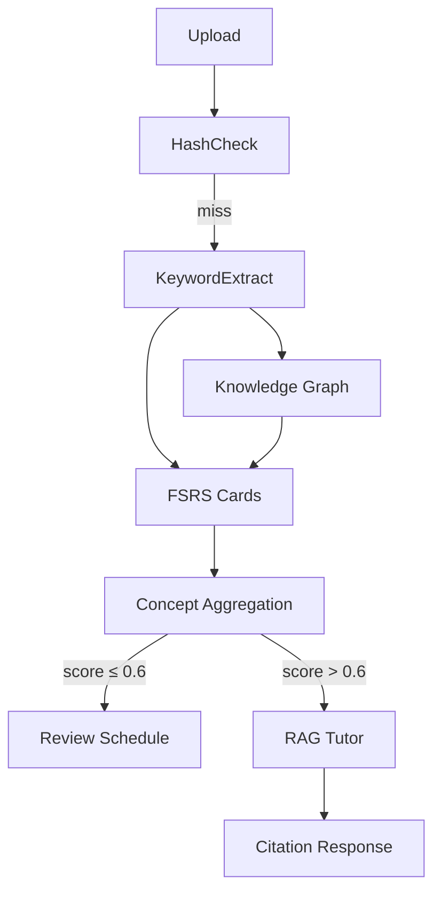

# Ke hoach phat trien NEXL (11 tuan)
Lưu ý: Nếu Gemini 2.0 Flash không khả dụng thì dùng Gemini 2.5 Flash
## 1) Muc tieu tong quan
- Hoan thien 3 mui nhon (FSRS + Knowledge Graph + RAG Tutor) theo lo trinh 11 tuan.
- Uu tien he thong on dinh, tiet kiem quota AI, co so lieu danh gia ro rang.
- Bao ve phan hien co, khong lam gian doan cac chuc nang da co.

## 2) Gia dinh va rang buoc
- Backend ket hop:
  - Node.js: upload, hash-cache, message queue, rate limit.
  - Python (FastAPI): FSRS, Knowledge Graph, RAG pipeline, API chinh.
- Co so du lieu:
  - PostgreSQL (Supabase) cho FSRS, Knowledge Graph, RAG (pgvector).
  - MySQL (hien co) tiep tuc dung cho cac module dang on dinh; ket noi thong qua user_id chung.
- AI/LLM:
  - Keyword extraction: Gemini 2.0 Flash.
  - RAG generation: Gemini 2.5 Flash.
  - Embedding: Google text-embedding-004 (hosted).
- UI/UX Roadmap: khong can timeline, uu tien thao tac sua nhanh (drag/drop + inline edit).
- Free tier co the thay doi quota, can co cache + rate limit.

## 3) Pham vi
### 3.1 In scope
- FSRS Adaptive Review Schedule.
- Concept-level Aggregation Layer.
- Keyword Extraction -> Knowledge Graph.
- Roadmap generator + UX chinh sua nhanh.
- RAG pipeline + citation UI.
- Hash-cache SHA-256, queue, rate limit, idempotency.

### 3.2 Out of scope
- Community library + semantic search cong dong.
- Block editor giau tinh nang (Notion-like).
- PWA/Offline sync.
- AI auto-complete khi go.

## 4) Kien truc tong quan (muc tieu)




## 5) Ke hoach theo giai doan (11 tuan)

### Giai doan 1 (Tuan 1-2): Nen mong & he thong toi uu
**Muc tieu:** On dinh ha tang, san sang cho AI pipeline.

**Backend Node.js**
- Xay dung dich vu upload (file/URL/text) va tinh SHA-256.
- Hash-cache: so sanh hash trong DB, trung thi tra ve cache ngay.
- Queue co ban (Redis + BullMQ) cho xu ly bat dong bo.

**Backend Python (FastAPI)**
- Bo sung endpoint nhan ket qua upload, luu thong tin document.
- Them middleware idempotency cho cac POST quan trong.

**Data/DB**
- Tao cac bang Postgres cho: documents, document_hash, cache_hit, ai_jobs.
- Lien ket user_id giua MySQL hien co va Postgres (mapping table neu can).

**DevOps/QA**
- Rate limit tren API gateway (Redis token bucket).
- Logging va tracing co ban cho job queue.

**Deliverables**
- Upload flow co hash-cache.
- Queue + rate limit chay duoc trong moi truong dev.
- DB schema cho document va cache.

**Exit criteria**
- Upload cung file 2 lan thi lan 2 tra ket qua cache < 1s.
- He thong khong qua tai khi batch 20 file.
- P95 response time < 3s khi 20 file chay song song.

**Rui ro & giam thieu**
- Rui ro: ket noi 2 DB phuc tap. Giam thieu: mapping user_id, viet adapter layer.
- Rui ro: queue bi mac ket. Giam thieu: retry policy + DLQ.

---

### Giai doan 2 (Tuan 3-5): Mũi nhon 1 & 2
**Muc tieu:** Xay dung FSRS + Knowledge Graph.

**Backend Python (FastAPI)**
- Tich hop py-fsrs va luu review logs.
- Concept-level aggregation: tinh weakness_score theo weighted stability.
- API: lay danh sach concept yeu, lay lich on tap.

**AI/LLM**
- Keyword extraction tu tai lieu moi (Gemini 2.0 Flash).
- Luu tags va quan he tag trong DB.

**Data/DB**
- Them tables: fsrs_cards, fsrs_reviews, concept_tags, concept_edges.
- Index cho truy van theo user_id va concept.

**Frontend**
- Do thi Knowledge Graph (D3.js hoac Vis.js).
- UI thong ke concept yeu va goi y on tap.

**Deliverables**
- FSRS chay duoc voi lich on tap theo user.
- Knowledge Graph hien thi tren UI.

**Exit criteria**
- Co the tao 1 document -> trich tag -> ve graph.
- Sau 3 lan review, lich on tap cap nhat dung.
- Stability tang sau "Good", giam sau "Again" — verify bang unit test.
- Knowledge Gap trigger dung: document co concept "Binary Tree" → score > 0.6 sau 3 lan tra loi sai → RAG Tutor duoc goi.

**Rui ro & giam thieu**
- Rui ro: tag bi nhieu. Giam thieu: prompt rang buoc + stopword list.
- Rui ro: FSRS khong khop schema. Giam thieu: test unit cho review update.

---

### Giai doan 3 (Tuan 6-7): UX/UI Roadmap + Gia su AI
**Muc tieu:** Roadmap co the sua nhanh, UX toi gian.

**Frontend**
- Roadmap UI: danh sach block, keo-tha reorder (dnd-kit/beautiful-dnd).
- Inline edit + nhanh: sua tieu de, doi nguon.
- Badge nguon tai lieu ro rang.

**Backend Python (FastAPI)**
- API roadmap generate (Gemini 2.0 Flash): JSON chi gom tieu_de va nguon.
- Luu roadmap theo user va versioning nhe.

**Deliverables**
- Roadmap edit nhanh (khong can timeline).
- Prompt roadmap on dinh JSON.

**Exit criteria**
- User tao roadmap tu goal va sua lai trong < 1 phut.
- JSON roadmap luon pass schema validation sau 10 lan test voi goal khac nhau.

**Rui ro & giam thieu**
- Rui ro: JSON loi. Giam thieu: schema validate + auto-repair.

---

### Giai doan 4 (Tuan 8-9): RAG Tutor (Mũi nhon 3)
**Muc tieu:** RAG co citation, accuracy cao.

**Backend Python (FastAPI)**
- Chunking pipeline + embedding text-embedding-004.
- Luu vector vao pgvector va truy van similarity-based ranking.
- Tao prompt grounded generation cho Gemini 2.5 Flash.

**Frontend**
- UI chat co citation: click de mo doan goc.
- Hien thi nguon va trich dan ro rang.

**Deliverables**
- RAG pipeline chay end-to-end.
- Chat co citation ro ranh.

**Exit criteria**
- Tra loi co citation va mo dung doan nguon.
- Precision@3 ≥ 70% tren bo 20 cau hoi test thu cong.

**Rui ro & giam thieu**
- Rui ro: precision thap. Giam thieu: cai thien chunking + topK.

---

### Giai doan 5 (Tuan 10-11): Kiem thu + So lieu + Bao cao
**Muc tieu:** Co metrics thuc te, bao cao danh gia.

**QA/Testing**
- Unit test cho FSRS update, concept aggregation, chunk retrieval.
- Integration test cho upload -> cache -> RAG.

**Evaluation**
- Learning curve (within-subject) cho 5-10 nguoi dung.
- Precision@K voi 20-30 cau hoi thu cong.
- Survey gap analysis (tu danh gia vs he thong).

**Deliverables**
- Bo so lieu danh gia.
- Bao cao cuoi ky + demo kit.

**Exit criteria**
- Bieu do learning curve ve tu it nhat 3 nguoi dung × toi thieu 5 session.
- Precision@K dat yeu cau.

---

## 6) Ke hoach theo module (tong hop)

### 6.1 Backend Node.js
- Upload + SHA-256 hash-cache.
- Queue (BullMQ) + retry/DLQ.
- Rate limit theo user va endpoint.

### 6.2 Backend Python (FastAPI)
- FSRS: card, review logs, scheduling.
- Knowledge Graph: tags, edges, concept aggregation.
- RAG: chunking, embedding, retrieval, citation.
- Roadmap API + schema validate.

### 6.3 Data/DB
- Postgres (Supabase): pgvector + tables cho RAG/FSRS/KG.
- MySQL (hien co): giu cac module cu.
- Mapping user_id, audit log, idempotency.

### 6.4 Frontend (React)
- Knowledge Graph view.
- Roadmap UI keo-tha + inline edit.
- Chat UI citation.

### 6.5 AI/LLM
- Keyword extraction prompt.
- Roadmap JSON prompt.
- RAG grounded prompt + citation format.
- Prompt templates chi tiet nen duoc ghi trong bao cao chinh va phu luc (keyword extraction, grounded generation, auto-repair JSON).

### 6.6 DevOps/QA
- Rate limit, queue monitoring.
- Logging, tracing, error alerting.
- Test suite cho pipeline chinh.

## 7) Metrics va danh gia
- FSRS: learning curve theo thoi gian, retention rate.
- RAG: Precision@K (K=3 hoac 5).
- Knowledge gap: tu danh gia vs he thong.

## 8) Rui ro tong quan va giam thieu
- Quota AI thay doi: cache + rate limit + retry.
- Doi schema DB: migration ro rang, rollback plan.
- Chat citation sai: bat buoc trung khop chunk id.
- Hieu nang vector search: index HNSW, gioi han topK.

## 9) Artefacts bao cao
- So do he thong, so do luong du lieu.
- Bang tien do 11 tuan.
- Tap du lieu test va ket qua metrics.
- Demo guide (use-case, data mau).

## Bổ sung từ BoSungKeHoach
Những mục dưới đây là các bổ sung kỹ thuật và timeline chi tiết được đề xuất để đưa thẳng vào kế hoạch (đã kiểm tra và phù hợp với phạm vi dự án). Nên giữ làm phần mở rộng ở phần kế hoạch chính để không làm rối nội dung tóm tắt.

### Bổ Sung 1 — Breakdown Theo Tuần
Ghi rõ công việc từng tuần (11 tuần):

| Tuần | Giai đoạn | Việc làm chính |
|------|-----------|----------------|
| 1 | 1 | Upload service, tính SHA-256, bảng `document_hash` |
| 2 | 1 | Hash-cache, Redis queue (BullMQ), rate limit, middleware idempotency |
| 3 | 2 | `py-fsrs` integration, bảng `fsrs_cards` + `fsrs_reviews`, API lịch ôn |
| 4 | 2 | Keyword extraction (Gemini), bảng `concept_tags` + `concept_edges`, concept aggregation layer |
| 5 | 2 | Frontend KG (D3.js), UI điểm yếu + gợi ý ôn tập, test FSRS end-to-end |
| 6 | 3 | Roadmap generator API (Gemini → JSON), schema validate + auto-repair |
| 7 | 3 | Roadmap UI drag/drop + inline edit (dnd-kit) |
| 8 | 4 | Chunking pipeline + embedding (text-embedding-004) + lưu pgvector |
| 9 | 4 | Grounded generation (Gemini 2.5 Flash) + Citation UI click-to-source |
| 10 | 5 | Unit/integration tests, thu thập dữ liệu (5–10 người dùng thật) |
| 11 | 5 | Tính metrics, viết báo cáo, dựng demo kit |

### Bổ Sung 2 — Đặc Tả Kỹ Thuật Concept-Level Aggregation
Đề xuất thêm mô tả kỹ thuật vào Giai đoạn 2 — function tính `weakness_score` và schema lưu trữ:

```python
# services/concept_aggregation.py

def compute_weakness_score(cards: list[FSRSCard]) -> float:
    """
    weakness_score ∈ [0.0, 1.0]  —  càng cao = khái niệm càng yếu
    Trả về 0.5 nếu chưa có card (unknown concept).
    """
    if not cards:
        return 0.5

    total_weight, weighted_stability = 0.0, 0.0
    for card in cards:
        # difficulty ∈ [1,10] trong py-fsrs — card khó được ưu tiên hơn
        weight = card.difficulty
        weighted_stability += card.stability * weight  # stability: đơn vị ngày
        total_weight += weight

    avg_stability = weighted_stability / total_weight

    # Ngưỡng: stability ≥ 21 ngày → nhớ vững (score → 0)
    #          stability ≤ 3 ngày  → rất yếu  (score → 1)
    MAX_STABLE = 21.0
    score = max(0.0, min(1.0, 1.0 - (avg_stability / MAX_STABLE)))
    return round(score, 4)


WEAK_THRESHOLD = 0.60  # score > ngưỡng này → trigger Knowledge Gap + RAG
```

Schema bổ sung cho bảng `concept_weakness` (update sau mỗi review session):

```sql
CREATE TABLE concept_weakness (
  user_id       VARCHAR NOT NULL,
  tag_id        UUID    NOT NULL REFERENCES concept_tags(id),
  weakness_score FLOAT  NOT NULL DEFAULT 0.5,
  card_count    INT     NOT NULL DEFAULT 0,
  last_updated  TIMESTAMPTZ DEFAULT now(),
  PRIMARY KEY (user_id, tag_id)
);

CREATE INDEX idx_weakness_user_score
  ON concept_weakness (user_id, weakness_score DESC);
```

### Bổ Sung 3 — Tham Số RAG Chunking
Đề xuất cấu hình chunking/retrieval để đưa vào Giai đoạn 4 (backend config):

```python
# config/rag_config.py

CHUNKING = {
    "chunk_size":     512,
    "chunk_overlap":   64,
    "split_by":  "sentence",
    "min_chunk_tokens": 80,
    "metadata": ["doc_id", "chunk_index", "page_number", "source_text_preview"],
}

RETRIEVAL = {
    "top_k":              5,
    "similarity_threshold": 0.72,
    "ranking_metric": "cosine",
}
```

Và index pgvector gợi ý cho migration:

```sql
CREATE INDEX ON document_chunks
  USING hnsw (embedding vector_cosine_ops)
  WITH (m = 16, ef_construction = 64);
```

### Bổ Sung 4 — Luồng Tích Hợp 3 Mũi Nhọn
Đưa vào phần kiến trúc một luồng tích hợp ngắn mô tả vòng lặp upload → KG → FSRS → aggregation → RAG:

```
[Upload tài liệu]
  │
  ▼
[Hash check] ──cache hit──▶ trả kết quả ngay
  │ miss
  ▼
[Keyword Extraction]  ──▶  concept_tags + concept_edges (KG)
  │                          │
  ▼                          ▼
[Tạo FSRS cards]          [Vẽ Knowledge Graph UI]
[Tính lịch ôn tập]
  │
  ▼  (sau mỗi review session)
[Concept-level Aggregation]
 weakness_score cho từng tag
  │
  ├── score ≤ 0.60 ──▶ lên lịch ôn tập bình thường
  │
  └── score > 0.60 ──▶ [Trigger RAG Tutor]
            │
          query = "giải thích {concept}"
            │
          semantic search top-K chunks
            │
          boost score cho chunks có tag_ids chứa tag của concept yếu
            │
          Gemini 2.5 Flash grounded generation
            │
          trả về citation [Nguồn: file.pdf, đoạn trang X]
```

Gợi ý schema để liên kết chunk và tag:

```sql
ALTER TABLE document_chunks
  ADD COLUMN tag_ids UUID[] DEFAULT '{}';

UPDATE document_chunks
   SET tag_ids = ARRAY[$2, $3]::uuid[]
 WHERE doc_id = $1;
```

`tag_ids` được gán sau keyword extraction bằng cách map tag của document vào từng chunk theo overlap nội dung hoặc similarity giữa chunk text và tag label. Logic retrieve nên ưu tiên chunks chứa tag của concept đang yếu: chạy semantic search top-K, sau đó cộng điểm boost cho chunks có `tag_ids` giao với tag của concept trigger.

Gợi ý: giữ sequence diagram tương ứng trong phần báo cáo kỹ thuật.

---
Giữ các phần API endpoint listing và DB schema chi tiết trong phụ lục báo cáo — phần này chỉ ghi các thông số, công thức và criteria quan trọng để reviewers có thể đánh giá kỹ thuật.
